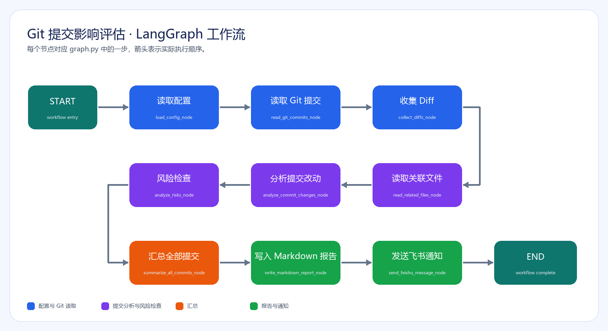

# Git LangGraph Code Gate

本项目是一个本地运行的 Git 提交分析 Agent：读取提交、diff 和提交版本中的相关文件内容，逐提交分析后汇总为 Markdown 报告。流程由 LangGraph 编排，不修改业务仓库。

## 工作流



## 快速开始

```powershell
python -m pip install -r requirements.txt
Copy-Item .env.example .env
# 编辑 .env，至少填写 REPO_PATH 和 NUM；配置 API_KEY 后会调用模型
python run.py
```

没有 API_KEY 时仍可运行本地基础模式，报告会包含提交、文件、模块和基础风险启发式检查；配置 API_KEY 后使用 `langchain-openai` 调用 OpenAI 兼容模型。

完整的 macOS 和 Windows 配置、运行和故障排查步骤请参考：[使用说明.md](使用说明.md)。

报告结构与行为约束请参考：[需求文档.md](需求文档.md)。

在 `.env` 中用 `NUM` 控制评估最近多少次提交，例如 `NUM=100` 表示分析最近 100 次提交。未配置时默认分析最近 30 次；旧配置名 `COMMIT_LIMIT` 仍然兼容，命令行 `--limit` 可以临时覆盖配置。

也可以用命令行覆盖范围：

```powershell
python run.py --repo D:\project\my-repo --limit 10
python run.py --repo D:\project\my-repo --since 2026-07-01 --until 2026-07-17
python run.py --repo D:\project\my-repo --base abc123 --head def456
```

## 目录

```text
git_agent/
  config.py             配置和 .env 读取
  git_reader.py         Git commit、diff、文件上下文读取
  analyzer.py           模型分析和离线降级分析
  risk_checker.py       风险启发式检查
  summarizer.py         （可由后续版本拆出）
  report_writer.py      Markdown 报告
  feishu_notifier.py    飞书 webhook 摘要
  graph.py              LangGraph 工作流
run.py                  命令行入口
```

## 约束

- 默认跳过锁文件、日志、构建产物、压缩后的前端资源等噪声文件。
- 每个提交的 diff 和文件上下文都会截断，避免一次请求过大。
- 二进制文件不发送给模型。
- 输出报告路径默认为当前执行目录下的 `git-agent-report.md`。
